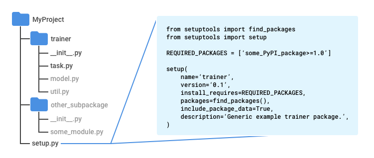

run-on-gcp version

gcp guide 

https://cloud.google.com/ml-engine/docs/tensorflow/getting-started-training-prediction#tensorboard-local

project structure

modifications

(1) add REQUIRED_PACKAGE= ['GCSFS' ] in setup.py

(2) export model at the end, instead of each epoch.

(3) launch TensorBoard in cloud shell on gcp console.

